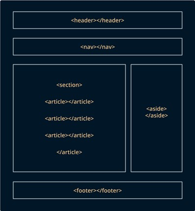
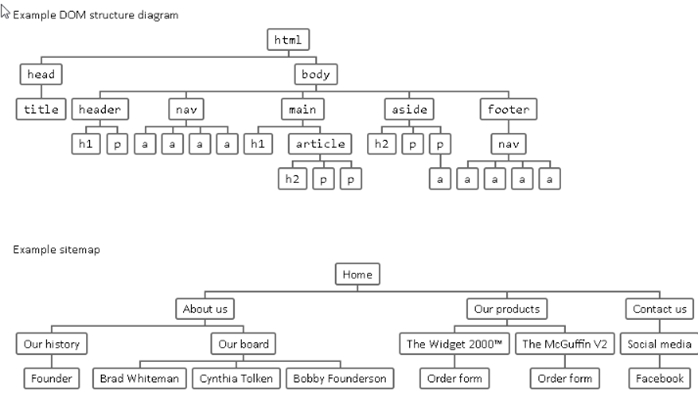
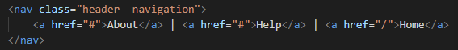
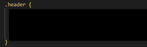
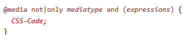
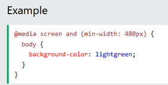
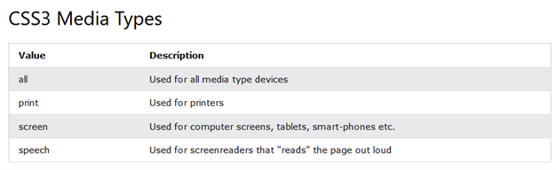

# Laborhilfe Aufgabe_1

## TEIL A – HTML

[https://developer.mozilla.org/en-US/docs/Web/HTML/Element/input](https://developer.mozilla.org/en-US/docs/Web/HTML/Element/input)

### Head Metadaten
  - **meta charset = „UTF-8":** Kodierung in UTF-8 Characters
  - **meta name = „viewport":** Display-Information, Display-Größe vom Gerät
  - **meta content = „content":** Enthält Wert vom Element gekennzeichnet durch „name"
  - **title:** Beschreibung im Tab
  - **link:**
    - **rel:** Relationship zum verlinkten Dokmuent
    - **href:** Pfad/ Link-URL

### Body 
**Inhalt der GeoLocationApp**
  - **Header** : Obere Leiste, meist mit Logo, Titel, Navigation
  - **Main:** Hauptinhalt mit Vielzahl an verschiedenen Strukturelementen
  - **Footer** : Untere Leiste meist mit Kontakt, Impressum, Copyright, Sitemap
  _________
### Class-Attribut
  - Globales Attribut
  - Durch Leerzeichen-getrennte Liste von Case-Sensitive Element-Klassen
  - Erlauben die Auswahl und Zugang von CSS und JavaScript zu spezifischen Elementen durch Class-Selectors (z.B. documtent.getElementByClassName)
  _________
### Header
  - **nav** : Section-Element einer Seite die Links zu anderen Seiten enthält (Navigation)
  
  _________

### Main
  - **section** : Abschnitt, meist eines Textes, sollten immer eine Überschrift haben
    - **Child** -Elements: Überschriften, Formulare, div-Container, und mehr.

  - **form** : Sektion mit interaktiven Controls/ Feldern, um Informationen gebündelt zu senden

    - **Attribute**
      - **id:** Eindeutiger Bezeichner für Formular
      - **action** : URL, die das Submit der gesendeten Formular-Infos bearbeitet
      - **method** : http Methode mit der submitted wird
        - **Post** : Daten als Request Body gesendet
        - **Get** : Daten beigefügt mit ? seperator (Seitenanfrage), ohne selber Infos zu schicken
    - **Child-Elements:** fieldset

  - **h1 bis h8:** Überschriften (h1 größte, h8 kleinste)

  - **div:** Container zur Isolierung von verschiedenen flow contents

    - Möglich verschiedene div-Container verschieden zu Stylen
    - Kapselt Informationen voneinander (unterschiedliche Darstellung)
    - **Flow Content** : Alle Strukturelemente, die direkte Child-Elemente von \<body\> sind
    - **Kein Flow Content:** \<td\>, da es nur als direkter Child von \<table\> genutzt werden kann

  - **ul:** Ungeordnete Liste (unordered list = ul) mit einfachen Aufzählungspunkten
  - **ol** : Geordnete Liste (ordered list = ol) mit Nummerierung
  - **li:** Listen-Element (list item = li) von einer Liste (ol oder ul)

  - **img:** eingebettetes Bild

    - **Attribute:**
      - **src:** Quelle/Pfad
      - **alt:** alternativer Text, wenn Bild nicht lädt
      - **id:** eindeutiger Bezeichner eines Bildes

  - **fieldset:** gruppiert Kontrollelemente und Labels innerhalb einer Form

  - **legend:** Caption/ Beschreibung für den Inhalt von fieldset

  - **label:** Caption für ein Kontrollelement/ User Interface

    - **Attribute**
      - **for:** gibt an für welches Element das Label ist, angegeben durch „id"

  - **input:** für interaktive Kontrollelemente in Formularen, um Daten zu senden

    - **Attribute**
      - input-types: checkbox, button, hidden, mail, password, …
      - name: Kontroll-Element-Name
      - id: eindeutiger Bezeichner für input-Element
      - placeholder: Beispieltext der überschrieben werden kann
      - pattern: Erlaubter Eingabetext
      - maxlength: maximale Wortlänge
      - required: muss ausgefüllt werden
      - disabled: deaktiviert (keine Eingabe mögliche, ausgegraut)
      - value: fester/fixer eingetragener Wert meist mit readonly
      - readonly: nur lesbar, nicht überschreibbar
      
### footer
  - **span:** Generischer Container für Inline (Einzeiler), zur Gruppierung verwendbar

    - Ähnlich wie div (aber div ist Block-Element)
    - Hervorheben von bestimmten Wörtern in Text

## TEIL B - CSS

### Allgemeine Infos

- CSS-Template enthält Regelmengen für Klassen/ Classes „.row" und „.col-x"

- Erstellte HTML Struktur-Elemente von TEIL A entsprechend als Zeile/ Spalte kennzeichnen, durch hinzufügen von jeweiligen class name
  ____
**Mögliche Aufteilung**

- .col-x =\> 1/4 of main box for tagging (left box)
- .col-x =\> 3/4 of main box for discovery (right box)
- .col-x =\> 1/3 of right box for taglist (left box of discovery)
- .col-x =\> 2/3 of right box for map image (right box of discovery)
  ____
### Flexbox-Guide
[https://css-tricks.com/snippets/css/a-guide-to-flexbox/](https://css-tricks.com/snippets/css/a-guide-to-flexbox/)

- Style-Regeln die sich auf mehrere HTML-Elemente gleich auswirken können zusammengefasst werden
- Nachträglich kann für Unterschiede nochmals Regeln für die Elemente einzeln definiert werden
- Style-Regeln wirken der Reihenfolge nach in der sie definiert werden

  ____
### Selectors

### Beispiele
- input:not(:last-child) =\> wendet die folgenden Style-Regeln für alle Input-Felder außer dem letzten an
- input:hover =\> -//- wenn Mauszeiger über Input-Feld
- [https://www.dropbox.com/s/h2hni9o1m1di989/CSS%20selectors%20cheatsheet.pdf?dl=0](https://www.dropbox.com/s/h2hni9o1m1di989/CSS%20selectors%20cheatsheet.pdf?dl=0)
- [https://htmlcheatsheet.com/css/](https://htmlcheatsheet.com/css/)

### Anwendung
- Klassen-Selektor nutzen
- Ggf. neue Klassen zu HTML-Struktur-Elementen zufügen

- Spezifisches Selektieren von Elementen innerhalb einer Klasse möglich
- Z.B. wenn man nur die Überschriften innerhalb Tagging stylen möchte und nicht die von Discovery:

h2 würde sich auf alle h2-Elemente beziehen

.main\_tagging h2 bezieht sich nur auf h2-Elemente innerhalb der Klasse .main\_tagging

- Reihenfolge wichtig:
  - z.B. Ausrichtung soll für jede Überschrift gleich sein: center
  - Aber Farbe soll unterschiedlich sein abhängig von Klasse

  ____
### Mögliche Style-Regeln
**Other HTML elements you have to style**
- Überschriften h1-h8
- fieldset
- label
- input

**Beispiel-Attribute**
- margin: Platz zwischen der Grenze eines Elements zur Grenze eines angrenzenden Elements
- padding: Platz zwischen Element-Inhalt und Element-Grenze
- border: Grenze, an der das Element endet
- -bottom/-top, margin-right/-left (für margin, padding, border)
- display: Positionierung von Elementen (block, inline)

[https://developer.mozilla.org/en-US/docs/Web/CSS/display?retiredLocale=de](https://developer.mozilla.org/en-US/docs/Web/CSS/display?retiredLocale=de)

- color: Farbe des Elements (letzt definierte Farbe gilt)

- line-heigth: Höhe eines Elements

[https://developer.mozilla.org/en-US/docs/Web/CSS/line-height](https://developer.mozilla.org/en-US/docs/Web/CSS/line-height)

- cursor: Darstellung des Mauszeigers über einem Element

[https://developer.mozilla.org/en-US/docs/Web/CSS/cursor?retiredLocale=de](https://developer.mozilla.org/en-US/docs/Web/CSS/cursor?retiredLocale=de)

- appearance: Darstellung von UI Controls

[https://developer.mozilla.org/en-US/docs/Web/CSS/appearance](https://developer.mozilla.org/en-US/docs/Web/CSS/appearance)

- transition: Übergang zwischen zwei Phasen/ States eines Elements
 Verzögerung (Delay), Dauer (Duration), Property (Eigenschaften)

[https://developer.mozilla.org/en-US/docs/Web/CSS/transition?retiredLocale=de](https://developer.mozilla.org/en-US/docs/Web/CSS/transition?retiredLocale=de)

- align-items: Ausrichtung aller direkter Child-Elemente

[https://developer.mozilla.org/en-US/docs/Web/CSS/align-items?retiredLocale=de](https://developer.mozilla.org/en-US/docs/Web/CSS/align-items?retiredLocale=de)

  ____
### flex-direction

- Gibt an, wie die Items innerhalb eines Flex-Containers angeordnet werden (axis/ direction)
- [**https://developer.mozilla.org/en-US/docs/Web/CSS/flex-direction**](https://developer.mozilla.org/en-US/docs/Web/CSS/flex-direction)
- Media-Queries: Sollte bei Handy-Bildschirmen z.B. column sein mit width = 100%, damit die Elemente untereinander rutschen
  ____

### Style-Regeln umsetzen für

- Header-Component
- Main-Component
- Tagging-Component
- Discovery-Component
- Footer-Component
- Media Queries
____

## Media-Queries**

[**https://www.w3schools.com/css/css3\_mediaqueries.asp**](https://www.w3schools.com/css/css3_mediaqueries.asp)

- @media: Kennzeichnet Anfang einer Media-Query

