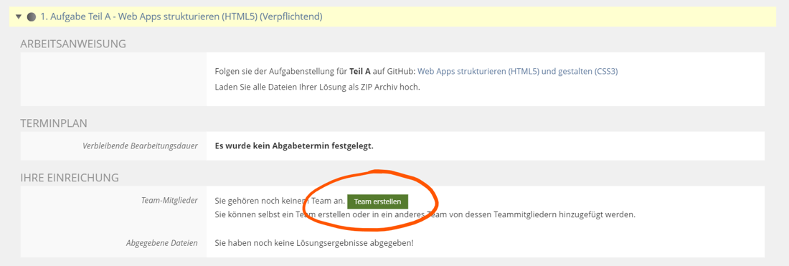
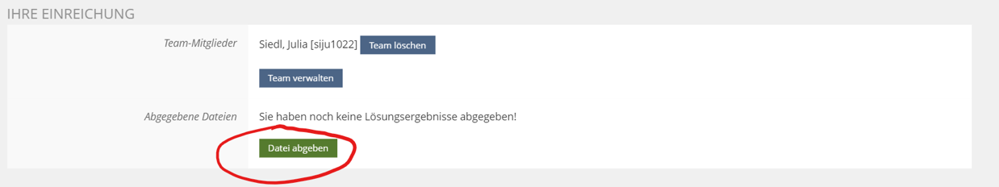
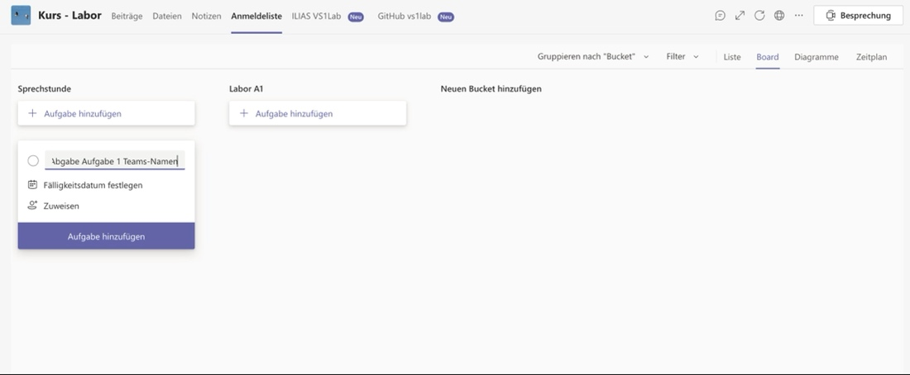
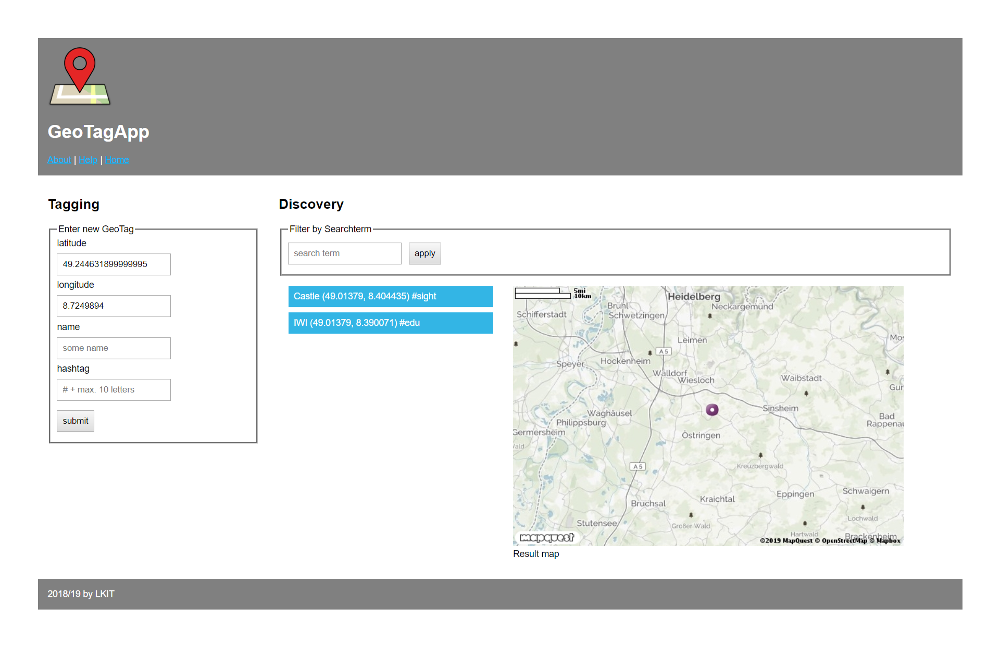

# Laboranleitung

*Diese Anleitung ist als Starthilfe gedacht,* *um Studenten die ersten Schritte
im Labor "Verteilte Systeme 1" zu erleichtern.*

------
Letztes Update (Sommer 2021): Armin Kunkel, Benjamin Schliebitz, Felix
Nagy,

Niklas Gadermann, Stephan Westphal

------

## Organisatorisches

Beim VS1 Labor handelt es sich um **Gruppenarbeit**. Der Quellcode muss
**vor der Abnahme** im ILIAS hochgeladen werden. Die Abgabetermine sind
dem ILIAS Kurs zu entnehmen, wobei Korrekturen bis Freitag nachgereicht
(hochgeladen) werden müssen. Bei Korrekturen erfolgt dann eine weitere
Abnahme beim nächsten Termin. Bei jeder Abgabe muss **jedes**
Teammitglied (virtuell) anwesend sein.

Wenn ein Gruppenmitglied bei der Abgabe nicht anwesend war, so kann er
diese, unter Vorlage einer Begründung für die Abwesenheit, nachholen.

Wichtig bei der Abgabe ist außerdem, dass **jedes Mitglied** der Gruppe
den Code **verstanden** hat. Es ist daher nicht ausreichend, wenn eine
einzelne Person den gesamten Code vorstellt.

Es gibt eine Bonusaufgabe, welche nicht abgegeben werden muss, um das
Labor zu bestehen. Es ist jedoch zu empfehlen, die Aufgabe zu
bearbeiten, da deren Abgabe mit **Bonuspunkten** für die Klausur belohnt
wird.

## Ablauf der Abgabe

Die Verwaltung der Gruppe erfolgt im Ilias. Hier wird die Lösung hochgeladen
und es kann auch überprüft werden, ob die Aufgabe als bestanden eingetragen
wurde. Die verpflichtende Besprechung der Aufgabe mit den Tutoren erfolgt in
Teams.

1.  Im Ilias erstellt eine Person ein Team und kann mithilfe der Kürzel
    die Gruppenmitglieder hinzufügen.
    

2.  Die Lösung der Aufgabe wird ins Ilias hochladen z.B. als zip-Archiv

3.  In Teams den zur Aufgabe passenden Kanal öffnen\
    (Für Aufgabe 1 den Kanal "Labor Aufgabe 1 -- HTML und CSS"
    verwenden)

4.  Unter dem Reiter Anmeldeliste eine neue Aufgabe erstellen mit den
    Microsoft Teams Namen der Gruppenmitglieder
    

5.  Die Gruppenmitglieder werden von einem Tutor zu einer Besprechung
    eingeladen

6.  Nach erfolgreicher Abgabe trägt der Tutor die Aufgabe als bestanden ein

## Die Aufgabenstellung

Im Laufe des Semesters soll eine Single-Page-Webanwendung entstehen mit
der ihr interessante Orte in Form von GeoTags speichern, verwalten und
teilen könnt.

Die "Geo Tagging App" besteht im Grunde aus zwei Komponenten:

### Der Tagging-Bereich

Hier können neue GeoTags durch die Eingabe aller Attribute (Längen-/ und
Breitengrad der Koordinate, Name und Hashtag) angelegt werden.

### Der Discovery-Bereich

Der Discovery-Bereich ist etwas komplexer aufgebaut. Er besteht zum
einen aus einer Liste und einer Karte, in denen bereits erstellte
GeoTags in einem bestimmten Umkreis angezeigt werden.

Außerdem bietet das Formular im oberen Bereich der Discovery-Komponente
die Möglichkeit bestehende GeoTags anhand eines Suchbegriffs zu filtern.

Natürlich müsst ihr die komplette Anwendung nicht von Grund auf selbst
konzipieren. Herr Professor Zirpins stellt euch auf Github eine Art
Vorlageprojekt zur Verfügung, in dem der grundsätzliche Aufbau der
Web-App, sowie die wichtigsten Komponenten bereits definiert und
teilweise implementiert sind. In den Vorlagen ist auch immer genau
gekennzeichnet, an welchen Stellen noch etwas fehlt bzw. wo eure Lösung
hin soll.

Wie ihr diese Vorlage auf die Poolrechner oder eure eigenen Rechner
bekommt seht ihr im nächsten Kapitel.

Um die Web-Anwendung fertig zu stellen, müsst ihr im Laufe des Semesters
nach und nach Teilaufgaben lösen, die sich mit der praktischen Umsetzung
von (aus der Vorlesung bekannten) Webtechnologien beschäftigen. Diese
Aufgaben sind wie folgt gegliedert:

## Aufgabe 1

In Aufgabe 1 sollt ihr die Oberfläche der Geo Tagging App fertigstellen.
Im Vorlagen Projekt findet ihr die Dateien 'index.html' und 'style.css',
die entsprechend angepasst werden müssen.

-   index.html: Das HTML Grundgerüst muss um die Formulare für das
    Tagging und das Suchen ergänzt werden. Zu beachten ist hier, dass
    auch die Funktionalität und Validierung mir HTML5-Mitteln umgesetzt
    werden soll.

-   style.css: Über die Anpassung des Stylesheets der Geo Tagging App
    soll das visuelle Design der App optimiert werden. Dazu gehört, dass
    sich das Layout an verschiedene Endgeräte anpasst (responsive web
    page). Dies wird durch die Verwendung eines Grid Layout mit Flexbox
    erreicht.

## Aufgabe 2

In Aufgabe 2 soll dann das clientseitige JavaScript so angepasst werden,
dass die aktuellen Koordinaten automatisch in die entsprechenden
Eingabefelder eingetragen werden. Außerdem soll im Discovery Bereich,
statt einer statischen, eine dynamisch generierte Karte mit allen
vorhandenen GeoTags angezeigt werden.

!!! tip tipp
    Falls ihr nicht wisst, wo ihr ansetzen sollt, schaut mal in
    die Kommentare der 'geotagging.js' Datei. Vielleicht wird es dadurch
    etwas klarer.

## Aufgabe 3

Die dritte Aufgabe beschäftigt sich mit dem serverseitigen Teil der Geo
Tagging App. Dieser wird benötigt um GeoTags auf dem Server abzulegen
und bestehende Tags zu filtern. Im serverseitigen Script müssen gemäß
der Aufgabenstellung Daten-/ und Verwaltungsstrukturen für die GeoTags
definiert werden. Außerdem müsst ihr das Verhalten für verschiedene
Routen festlegen, in denen bestimmten Requests verarbeitet werden und
dynamisch erzeugte Ansichten als Response an den Client zurückgeliefert
werden.

Diese Ansichten werden mit der Template-Engine EJS generiert. Beispiele
für die Verwendung findet ihr z.B. unter
[https://github.com/mde/ejs/wiki/Using-EJS-with-Express](https://github.com/mde/ejs/wiki/Using-EJS-with-Express)
und [https://ejs.co/#install](https://ejs.co/#install).

Hier werdet ihr auch zum ersten mal die JavaScript Laufzeitumgebung
node.js und den darin enthaltenen Paketmanager npm verwenden.

Ladet euch dazu zunächst auf
[https://nodejs.org](https://nodejs.org/en/) die für eure
Plattform benötigten Installationsdateien herunter und installiert
Node.js (auf den Pool-Rechnern schon installiert).

Alles weitere könnt ihr der offiziellen Aufgabenstellung entnehmen.

## Aufgabe 4

In dieser Aufgabe sollen eigentliche keine neuen Features entwickelt
werden. Hauptsächlich geht es darum, die Performanz der Anwendung durch
asynchrone Kommunikation zwischen Client und Server zu optimieren. Ihr
müsst dazu neue Routen auf der Serverseite festlegen, die die
Funktionalität einer REST-Api bereitstellen. Außerdem müsst ihr das
clientseitige JavaScript so anpassen, dass das Speichern und Filtern von
GeoTags asynchron über AJAX abgehandelt wird. Somit umgeht ihr, dass bei
jedem Speichern und Filtern die komplette Seite serverseitig generiert
und übermittelt werden muss.

Wenn ihr euer Serverscript entsprechend angepasst habt und eure
REST-Schnittstelle vorab testen wollt, empfiehlt es sich diese mit einem
generischen REST Client zu testen.  
Zu empfehlen sind hier

Insomnia/Postman:
GUI Programme um requests zu erstellen und zu senden

Hoppscotch:
Browser-Extension, ähnlich wie Insonmia/Postman aber ohne Download und mit google-docs like cloud-speicherung

VS-Code rest client:
Extension mit der sich Requests die in Textform in einer Datei stehen absenden lassen können

Curl:
Command-line-interface für die Production-Ready http bibliothek libcurl

Durch das Testen könnt ihr Fehler frühzeitig ausfindig machen und beheben und
spart euch später viel Ärger mit lästigem debuggen.

**Die genaue Aufgabenbeschreibung findet ihr in den README.md Dateien im
Ordner der jeweiligen Aufgabe.**

!!! tip Tipp
    Auf [https://www.w3schools.com/](https://www.w3schools.com/)
    findet ihr viele Tutorials und Beispiele zu den gängigsten Web
    Technologien. Ein Blick lohnt sich auf alle Fälle!!!

