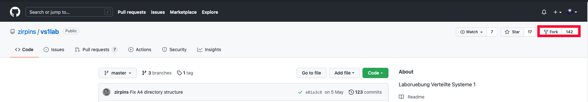
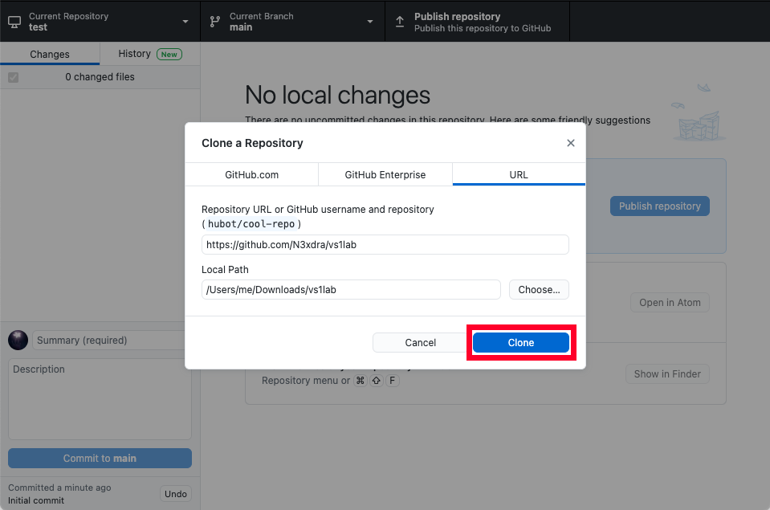
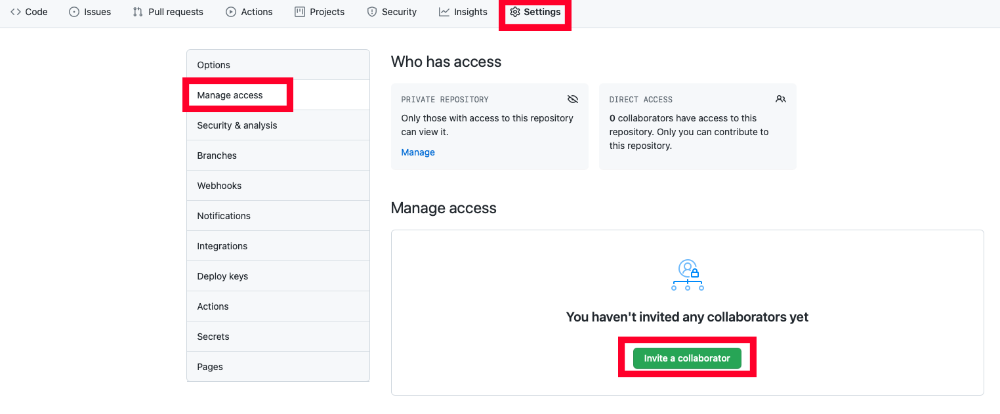

# Anleitung zur Einrichtung der Arbeitsumgebung für A1

## Git einrichten

Zuerst einen GitHub-Account anlegen auf https://github.com/.

Anschließend das VS1-Lab Repository forken auf https://github.com/zirpins/vs1lab.
Dazu muss rechts oben auf **Fork** geklickt werden.

Anschließend öffnet sich die GitHub-Seite der eigenen Kopie des Projekts. Dieses muss nun beispielsweise mit *GitHub Desktop* heruntergeladen werden.
GitHub Desktop ist eine grafische Benutzeroberfläche zum Verwalten von Git-Repositories und kann auf https://desktop.github.com installiert werden.

Auf der eigenen Repository-Seite, also dem geforkten Projekt, muss man nun auf **Code** und anschließend auf **Open with GitHub Desktop** klicken.

 
 Daraufhin öffnet sich ein Dialog in GitHub Desktop, der einstellt wohin die Dateien geladen werden sollen. Mit dem Bestätigen durch **Clone** werden die Dateien entsprechend heruntergeladen.
 

Anschließend öffnet sich das Repository und fragt, wie der Fork genutzt wird. Wähle dabei **For my own purposes** aus und bestätige mit **Continue**. 

Mit dem Button *Current Branch* lässt sich der aktuelle Branch wechseln oder neue Branches erstellen.
Die aktuellen Änderungen sind links bei *Changes* gelistet und können zusammen mit einer Commit-Nachricht auf den aktuellen Branch gepusht werden.
Den aktuellen Stand kann man mit dem *Fetch origin* bzw. dem *Pull origin* Button herunterladen, falls Aktualisierungen im Repository vorhanden sind.

Um weitere Benutzer hinzufügen zu können, muss man auf der eigenen Projektseite im Browser auf **Settings** -> **Manage access** -> **Invite a collaborator** klicken und den entsprechenden Benutzernamen eingeben. Hinzugefügte Benutzer finden das Projekt in ihrer GitHub Übersichtsseite und können von dort aus den Schritten befolgen das Projekt mithilfe von GitHub Desktop herunterzuladen.

## Laden in VSCode

Zuerst Visual Studio Code auf https://code.visualstudio.com/Download installieren.

Um das Projekt zu öffnen, muss nun in Visual Studio Code der **Explorer** links oben geöffnet werden und auf **Ordner öffnen** geklickt werden. Der zu öffnende Ordner ist derjenige, der bei GitHub Desktop als *Local Path* angegeben wurde.

Die Projektdateien zur ersten Aufgabe können entsprechend in *Aufgabe1/gta_v1/public* gefunden werden. Beispielsweise kann die *index.html*-Datei dort gefunden werden.

## Live Server Erweiterung

Anschließend kann die Live Server Erweiterung von https://marketplace.visualstudio.com/items?itemName=ritwickdey.LiveServer installiert werden.

Mithilfe des **Go Live** Buttons unten rechts, der mit der Live Server Erweiterung installiert wurde, lässt sich das Projekt starten. Änderungen an den Projektdateien werden, sobald diese gespeichert wurden, sofort im Browser sichtbar.

