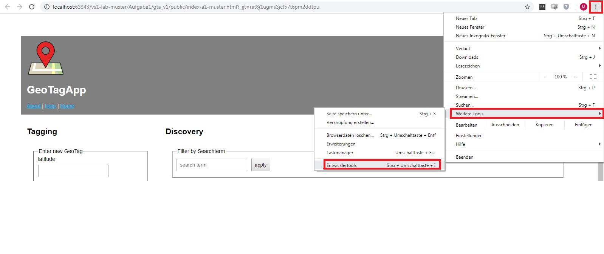
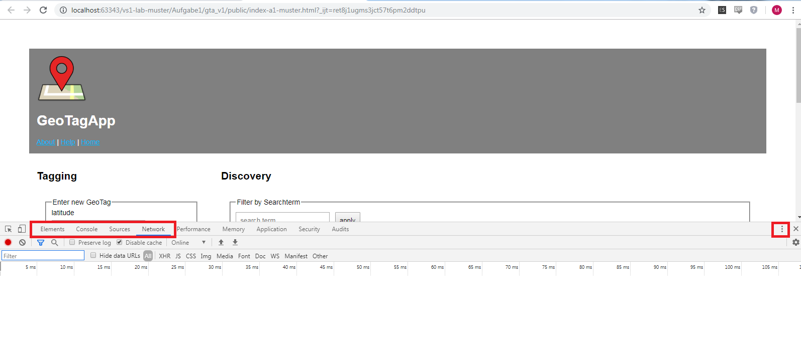
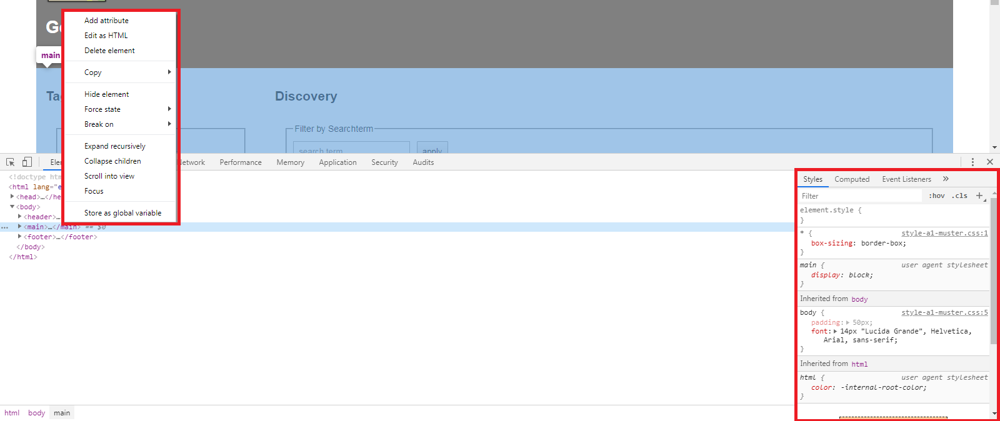
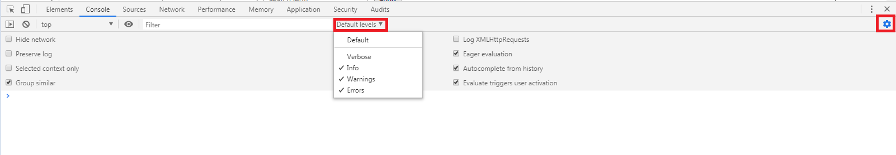
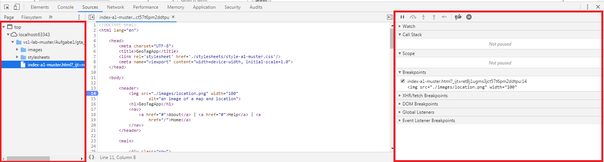
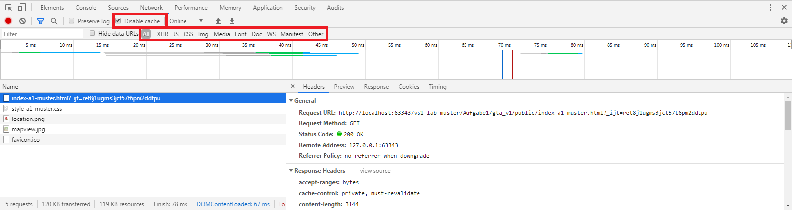

# Tools

## Git

Git ist ein Versionierungssystem für Dateien und Ordner in einem Projekt. Die
Gesamtheit des versionierten Projektes wird als Repository bezeichnet. Über
Webseiten wie GitHub (<https://github.com>) oder GitLab (<https://gitlab.com>)
ist es möglich, Repositories gemeinsam und gleichzeitig mit anderen Personen zu
bearbeiten.

Das Repository für Verteilte Systeme 1 finden Sie auf GitHub:
<https://github.com/zirpins/vs1lab>

Im Folgenden sind Schritte beschrieben, die Sie zur Nutzung von Git und
GitHub für Verteilte Systeme 1 nutzen können. **Wichtig:** Es besteht
keine Verpflichtung zur Nutzung von Git für die Bearbeitung der
Aufgaben. Wir empfehlen aber dennoch die Verwaltung via Git, da
Kollaboration und Versionierung dadurch erheblich erleichtert werden.

Git kann auch lokal zur Versionierung genutzt werden. Hierzu ist kein Account
notwendig.

### Installation von Git

Eine Übersicht zur Installation von Git erhalten Sie hier:

<https://git-scm.com/book/en/v2/Getting-Started-Installing-Git>

Falls Sie direkt zu den Downloads springen möchten, finden Sie diese
hier:

<https://git-scm.com/download>

Git nutzt zur Identifizierung eines Nutzers dessen Namen sowie
Email-Adresse. Nach erfolgreicher Installation können Sie in der
Kommandozeile Ihres Computers folgende Befehle ausführen, um Git zu
konfigurieren:

```sh

git config --global user.name "John Doe"
git config --global user.email johndoe@example.org
```

Verifizieren Sie die Korrektheit der Eingabe im Folgenden durch prüfen
der korrekten Werte:

```sh
git config user.name
git config user.email

```

sollte den von Ihnen gewählten Namen ausgeben.

### Das Repository forken

Grundsätzlich haben Sie viele verschiedene Möglichkeiten, mit Git an
einem Projekt zu arbeiten. Wir werden im Folgenden auf die für unseren
Fall am besten geeignete Methode eingehen: Das sogenannte „Forken" des
vs1lab-Repositories.

Beim Forken wird das Repository quasi in ein neues Repository kopiert,
welches dem eigenen Nutzer gehört. In diesem Repository können dann, im
Gegensatz zum Original-Repository von Herrn Dr. Zirpins, auch ohne
Probleme Änderungen vorgenommen werden, ohne das originale Repository zu
verändern.

Melden Sie sich bei GitHub an und navigieren Sie zum Repository „vs1lab"
(Link siehe oben).

Klicken Sie dann auf den Knopf „Fork":


Nach dem erfolgreichen „Forken" finden Sie eine Kopie des Repositories
unter Ihrem eigenen Nutzer (Klick auf Profilbild rechts oben, dann „Your
repositories"):


Nun muss das Repository noch lokal verfügbar gemacht werden. Hierfür
kann der Befehl

```sh
git clone <URL>
```

verwendet werden. Öffnen Sie eine lokale Kommandozeile und navigieren
Sie in den Ordner, in dem Sie das Repository lokal ablegen möchten.
Führen Sie dann den Befehl mit der URL zu Ihrem Fork aus:

```sh
git clone https://github.com/<username>/vs1lab
```

Falls Ihr Fork privat ist, fragt die Git-Anwendung nach Zugangsdaten zu
GitHub.com.

Nach dem erfolgreichen Klonen des Repositories auf den lokalen Rechner
kann nun problemlos (auch mit mehreren Teammitgliedern) parallel am
Projekt gearbeitet werden.

### Gemeinsam an Aufgaben arbeiten

Damit mehrere Mitglieder Zugriff auf ein GitHub-Repository haben, muss
dieser zuerst konfiguriert werden. Gehen Sie hierzu in GitHub auf den
Tab „Settings" Ihres Repositories und laden Sie unter dem Punkt „Manage
access" Ihre Teammitglieder ein:


Ihre Teammitglieder befolgen dann dieselben Schritte wie aus Abschnitt
2, um das Repository auf ihren lokalen Rechner zu klonen.

Um parallel an Code zu arbeiten, ohne sich gegenseitig zu stören, stellt
Git eine Funktion namens „Branches" bereit. Ein Branch ist vereinfacht
gesagt ein Abbild des Codes zu dem Zeitpunkt, an dem der Branch erstellt
wurde. Änderungen werden dann auf diesem Branch gespeichert und
irgendwann wieder in den Ausgangsbranch zurückgeführt.

Der Hauptbranch bei Git heißt meist „master" (in neueren Repositories
auch „main"). Die Branches selbst können frei benannt werden.

Ein Beispiel: Alice und Bob wollen nach erfolgreichem Klonen des
Repositories auf Ihre lokalen Rechner gemeinsam an der Bearbeitung der
Aufgaben arbeiten. Dazu erstellen beide einen eigenen Branch:

```sh
git checkout -b <branch-name>
```

(Der Befehl "checkout" wird zum Wechseln von Branches verwendet. Das
Argument „-b" erzeugt dann einen neuen Branch.)

Alice erstellt beispielsweise den Branch „html-und-css", während Bob den
Branch „javascript" erstellt. Beide können nun unabhängig voneinander
Ihre Aufgaben bearbeiten. Doch wie werden Änderungen zwischen Alice und
Bob synchronisiert?

Wenn Alice Änderungen an Ihrem Branch vorgenommen hat, dann muss Sie
diese Änderungen speichern. Git nennt diesen Prozess einen Commit: Es
können bestimmte Änderungen gewählt und gespeichert werden. Hierfür
werden zuerst die Dateien zum sogenannten Index (einer Art
Zwischenspeicher) hinzugefügt, die am Ende im Commit landen sollen. Nach
dem Commit (Der Commit speichert die Änderungen aus dem Index mit
zusammen mit einer Nachricht ab) muss Alice Ihre gespeicherten
Änderungen an GitHub senden. Dieser Prozess nennt sich „Push".

```sh
git add --all
git commit -m "Beschreibung der Änderung"
git push

```

(Möglicherweise beschwert sich Git, dass kein Upstream-Branch existiert.
In diesem Fall müssen Sie explizit angeben, auf welchen Branch der Push
ausgeführt werden werden soll. Für unsere Fälle gibt es keinen Grund,
nicht einfach denselben Branch zu verwenden. Der Push-Command lautet
dann:

```sh
git push --set-upstream origin <branch-name>
```


Anstelle des Parameters „\--all" können auch einzelne Dateien angegeben
werden. Nach Erfolgreichem Ausführen des Pushes sind die Änderungen auf
GitHub sichtbar. Wenn Bob nun die Änderungen von Alice herunterladen
möchte, so muss er sich zuerst die Änderungen holen, und sie dann in
seinen eigenen Branch integrieren:

```sh

git pull
git merge <alice's-branch-name>
```

Um sich im Repository zurechtzufinden, gibt es noch einige weitere
Befehle, die zwischendurch nützlich sein können:

```sh
git status
```

zeigt den Zustand des Repositories, inklusive aller geänderten Dateien
und Dateien, die zum aktuellen Commit hinzugefügt worden sind

```sh
git branch
```

zeigt den aktuell ausgewählten Branch, sowie weitere verfügbare
Branches.

```sh
git log --oneline --all
```

zeigt eine Historie aller vorangehenden Commits.

Sind Alice und Bob mit Ihren Änderungen fertig, so kann der jeweilige
Branch wieder in den Hauptbranch zurückgeführt werden. Hierzu wechselt
man auf den Hauptbranch und integriert dann den jeweils anderen Branch:

```sh
git checkout master
git merge <alice's-branch-name>
```

### Änderungen des Original-Repositories nachladen

Im Laufe der Vorlesung wird das Original-Repository erweitert. In diesem
Fall müssen die Änderungen des originalen Repositories in den Fork
übernommen werden. Hierzu kann eine Referenz auf das originale
Repository hinzugefügt werden, dessen Branches dann nach demselben
Prinzip in den Fork integriert werden können wie oben bereits gesehen.

Das standardmäßige Remote-Repository trägt den Namen „origin" und ist
bereits vorhanden, es referenziert den Fork. Um das vs1lab als neues
Remote-Repository hinzuzufügen, führen Sie den folgenden Befehl aus:

git remote add upstream https://github.com/zirpins/vs1lab.git

Überprüfen Sie danach die Existenz beider Remote-Repositories, indem Sie

```sh
git remote -v
```

ausführen:


Danach laden Sie die Änderungen des vs1lab und integrieren Sie in Ihren
eigenen „master"-Branch:

```sh
git fetch upstream
git checkout master
git merge upstream/master

```
Der Master-Branch Ihres lokalen Repositories ist nun aktuell. Wie weiter
oben beschrieben können Sie die Änderungen nun in Ihre eigenen Branches
integrieren. Denken Sie auch daran, git push auszuführen, um den
Teammitgliedern die Änderungen am „master"-Branch zur Verfügung zu
stellen.

Hier ein Beispielablauf:


### Ein Wort zum Git Tooling

Neben der Kommandozeile, die wir hier kennengelernt haben, gibt es auch
viele grafische Benutzeroberflächen, mit denen dieselben Abläufe
erreicht werden können. WebStorm und VSCode beispielsweise binden direkt
eine Git-Integration ein. Auch GitHub selbst bietet eine grafische
Benutzeroberfläche für das Verwalten von Git-Repositories an. Die Wahl
des Werkzeuges bleibt letztendlich Ihnen überlassen.

!!! tip "Hilfreiche Links"
    Der einfache Einstieg in Git:
    <https://rogerdudler.github.io/git-guide/index.de.html>  
    Kostenfreier Kurs:
    <https://www.udacity.com/course/version-control-with-git--ud123>  
    Git Dokumentation: <https://git-scm.com/doc>  
    Fork synchronisieren im Detail:
    <https://docs.github.com/en/github/collaborating-with-issues-and-pull-requests/syncing-a-fork>  


## VS code

### Allgemeines

VS-Code oder Visual Studio Code ist eine offene Entwicklungsumgebung von
Microsoft (nicht zu verwechseln mit Visual Studio). Das Tool ist sehr
universell ausgelegt und auf keine bestimmte Programmiersprache oder
Technologie zugeschnitten. Stattdessen kann der Support für Sprachen oder
Features über Extensions installiert werden. So wird VS code zur IDE für Java,
C, Web, Rust, Latex etc.

### Installation

### Windows & Mac

Das Setup kann unter der folgenden Adresse heruntergeladen werden:
[https://code.visualstudio.com/](https://code.visualstudio.com/)

### Linux

Ubuntu
```sh
sudo snap install --classic code
```

Arch
```sh
git clone https://aur.archlinux.org/visual-studio-code-bin.git
cd visual-studio-code-bin
makepkg -si
```

???+ tip "VS Code vs Code-OSS"
    Das Produkt VS Code ist eine modifizierte Version des Open-Source Editors
    Code-OSS. Bei Code-OSS fehlt das Microsoft-Branding, das Sammeln von
    Persönlichen Daten und aus [unerklärlichen
    Gründen](https://pics.me.me/thumb_hmmm-5960402.png) die Adresse des
    Extension-Marketplace. Diese Kann allerdings [manuell
    hinzugefügt](https://stackoverflow.com/questions/64463768/cant-find-certain-extensions-in-code-ossopen-source-variant-of-visual-studio-c)
    werden
    


### Remote container

Die Remote extension erlaubt es, sich mit einem Container zu verbinden und
diesen als entwicklungsumgebung zu nutzen.  Wenn eine Verbindung zu einem
Container besteht werden alle Dateien im VS code workspace im container
gespeichert und alle programme, die VSC startet laufen im Container.

#### Installation


#### Nutzung

TODO


### Installation

## Docker

### Container

Die Nutzererfahrung von Containern lässt sich als "Virtuelle Maschinen aber
nicht so langsam" beschreiben. Es sind isolierte Umgebungen, die ein eigenes
Betriebssystem mitsamt den Programmen, die darin laufen enthalten.

Der Große Vorteil an Containern ist, dass sie sich als container images
beliebig verbreiten lassen. Da ein Container sein eigenes Betriebssystem
enthält ist garantiert dass er überall genau so funktioniert wie auch auf dem
eigenen Computer.

Um die gute Performanz zu erreichen verwendet Docker einige Technologien, die
nur im Linux Kernel vorhanden sind, weshalb Docker für Windows und Mac beide in
einer virtuellen Maschine laufen müssen. 

### Installation

#### Linux

Arch Linux
```sh
sudo pacman -S docker
```

Ubuntu

```sh
sudo apt-get remove docker docker-engine docker.io containerd runc
sudo apt-get update
sudo apt-get install \
    apt-transport-https \
    ca-certificates \
    curl \
    gnupg \
    lsb-release

curl -fsSL https://download.docker.com/linux/ubuntu/gpg | sudo gpg --dearmor -o /usr/share/keyrings/docker-archive-keyring.gpg

echo \
  "deb [arch=amd64 signed-by=/usr/share/keyrings/docker-archive-keyring.gpg] https://download.docker.com/linux/ubuntu \
  $(lsb_release -cs) stable" | sudo tee /etc/apt/sources.list.d/docker.list > /dev/null

sudo apt-get update
sudo apt-get install docker-ce docker-ce-cli containerd.io
```

#### Windows

Das Setup von Docker für Windows kann unter
https://desktop.docker.com/win/main/amd64/Docker%20Desktop%20Installer.exe
heruntergeladen werden. 

Die virtuelle Maschine
Diese allerdings mithilfe von [WSL2](https://docs.docker.com/desktop/windows/install/#wsl-2-backend) um eini

#### Mac

```sh
command -v brew || /bin/bash -c "$(curl -fsSL https://raw.githubusercontent.com/Homebrew/install/HEAD/install.sh)"
brew cask install docker
```


## Debuggen in Google Chrome

Chrome, als auch weitere Browser, bieten eine Vielzahl von verschiedenen
Entwicklertools an. Die Entwicklungstools werden mit ++f12++ oder über

**Einstellungen -\> Weitere Tools -\> Entwicklertools** geöffnet.



Über die Tabs können die Verschiedenen Tools aufgerufen werden. Im
rechten Bereich sind weitere Einstellungen wie die Ausrichtung der Tools
möglich.



### Elements

In Elements wird der aktuelle DOM Baum angezeigt und Chrome bietet verschiedene
Möglichkeiten um den Baum zu manipulieren.

Mit einem Rechtsklick auf ein HTML Element wird die Option angezeigt.

Hier im Bild, im rechten Teil von Elements, werden die aktuellen Styles und
weitere Einstellungen für eine Node angezeigt.

Im Styles Bereich können die vorhandenen CSS Einträge manipuliert oder es
können eigene Regeln bzw. Attribute hinzugefügt werden.



### Console

Gibt verschiedene Nachrichten des laufenden JS-Codes aus. Bei Fehlern im
JS-Code, werden diese in der Console mit einem Stack-Trace ausgegeben. Auch
einfache Informationen oder Warnungen werden dort ausgegeben.

Für die Console kann ein level angegeben werden, welches besagt, welche
Nachrichten angezeigt werden.

Oben rechts befinden sich noch weitere Einstellungsmöglichkeiten für die
Console

In der Console kann auch JS-Code ausgeführt werden.

Mit *console.log()* lassen sich aus dem Code Nachrichten und Werte ausgeben.
Mit *console.error()* werden diese als Fehler formatiert und mit
*console.table()* kann man sich die Werte eines Arrays formatiert ausgeben
lassen.



### Sources

In Sources werden alle geladenen Inhalte und die Debugging Übersicht
angezeigt.

Durch das Öffnen einer Datei können Breakpoints gesetzt werden.

Alternativ kann man im Programmcode selbst (also in der IDE oder Editor) den
Befehlsaufruf ```"debugger;"``` hinzufügen um einen Breakpoint zu setzen.

Auf der rechten Seite befinden sich die bekannten
Debugging-Möglichkeiten, wie zum Beispiel das Fortsetzen bis zum
nächsten Breakpoint, Funktionsaufrufe zu überspringen, hinein oder
heraus zu springen.



### Network

Zeichnet den Netzwerkverkehr zwischen Webseite und Server auf. Es wird
dabei der Request, Response Header und die benötigte Zeit
aufgezeichnet. Auch der Response Body wird angezeigt und formatiert in
der ab Preview angezeigt.

Es werden auch mehrere Filteroptionen angeboten, um einen Überblick
beim Netzwerkverkehr zu haben.

Wichtig kann auch die Checkbox ```"Disable cache"``` sein, um mögliche
Fehler beim Entwickeln durch zu strenges Caching des Browsers zu
vermeiden.



Weitere Informationen findet ihr hier:
[https://developer.chrome.com/docs/devtools/](https://developer.chrome.com/docs/devtools/)
