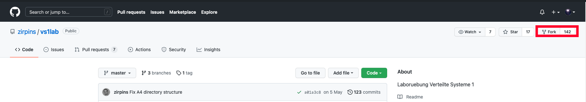
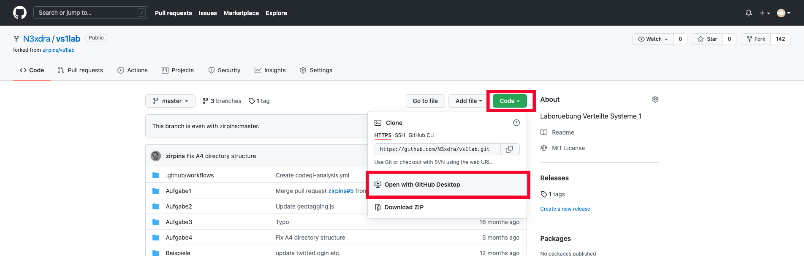
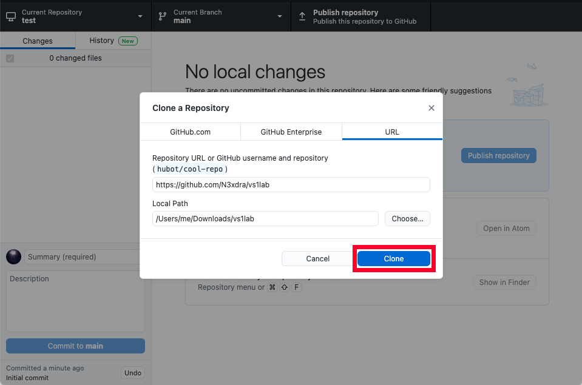
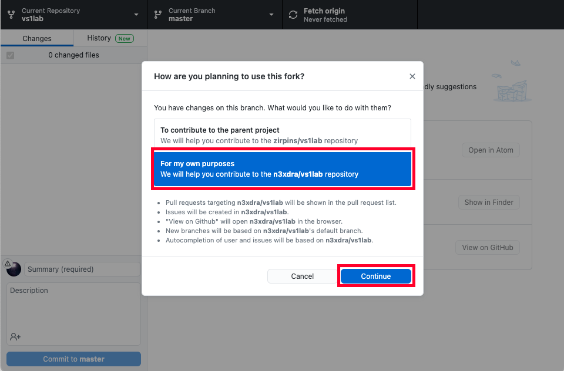

# GitHub Desktop

Dies ist eine Schritt für Schritt Anleitung, um das Labor mit GitHub und GitHub Desktop zu verwalten.
GitHub Desktop ist eine grafische Benutzeroberfläche zum Verwalten von Git-Repositories und kann auf https://desktop.github.com installiert werden.

Zuerst muss das Repository geforkt werden um eine Kopie davon auf dem eigenen Account zu erhalten.
Dazu muss rechts oben auf **Fork** geklickt werden.

Anschließend öffnet sich die GitHub-Seite der eigenen Kopie des Projekts. Dieses kann nun mit *GitHub Desktop* heruntergeladen werden.

Auf der eigenen Repository-Seite, also dem geforkten Projekt, muss man nun auf **Code** und anschließend auf **Open with GitHub Desktop** klicken.

 
 Daraufhin öffnet sich ein Dialog in GitHub Desktop, der einstellt wohin die Dateien geladen werden sollen. Mit dem Bestätigen durch **Clone** werden die Dateien entsprechend heruntergeladen.
 

Anschließend öffnet sich das Repository und fragt, wie der Fork genutzt wird. Wähle dabei **For my own purposes** aus und bestätige mit **Continue**. 

Mit dem Button *Current Branch* lässt sich der aktuelle Branch wechseln oder neue Branches erstellen.
Die aktuellen Änderungen sind links bei *Changes* gelistet und können zusammen mit einer Commit-Nachricht auf den aktuellen Branch gepusht werden.
Den aktuellen Stand kann man mit dem *Fetch origin* bzw. dem *Pull origin* Button herunterladen, falls Aktualisierungen im Repository vorhanden sind.

Um weitere Benutzer hinzufügen zu können, muss man auf der eigenen Projektseite im Browser auf **Settings** -> **Manage access** -> **Invite a collaborator** klicken und den entsprechenden Benutzernamen eingeben. Hinzugefügte Benutzer finden das Projekt in ihrer GitHub Übersichtsseite und können von dort aus den Schritten befolgen das Projekt mithilfe von GitHub Desktop herunterzuladen.

